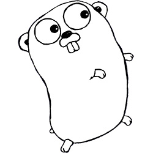

<!-- $theme: default -->


 

# Go 

## De programmeertaal

---

# Wat is Go?

1) Gecompileerde taal
2) Gebouwd voor het web
3) Stevige standaard libraries
4) Gebouwd door Google

---

# Wat wil go zijn?

1) Wil concurrency makkelijker maken
2) Wil een goede server taal zijn en voor het web gemaakt zijn. Maar kan zeker ook als general purpose gebruikt worden.
3) Wil Goede Performantie in verhouding met ease of use.

---

# Wie gebruikt golang?

* Docker
* Google
* Dropbox
* Soundcloud
* ...

---

# 'Hello world'


```go
package main

import "fmt"

func main(){
    fmt.Println("Hello, world")
}
```

---

# Lets get to the basics

---

# Variabelen

```go
var tekst string
```
of automatisch door go het type laten definieren of veranderen
```go
tekst := "Hello, world"
```
### Types
int32, int64, uint, byte, string, rune, ...

### conversie
```go
integer_var := 42
float_var := float64(integer_var)
```


---

# Loops
Spoiler: alles is een for-loop

```go
for{
    //Oneindige loop
}
```
```go
for i:=0; i < 10; i++{
    //Zo kennen we de gewone for die 10 keer uitvoerd
}
```
```go
i := 1
for i < 1000 {
    //Nu is het een "while" geworden
    i += i //voor als we willen op tellen
}
````
---

# Maps


---
# Functies 
### basis vorm
```go
func hello(){
    //logica
}
```
### met parameters
```go
func hello(x float64){
    //logica
}
```
### met return value
```go
func hello(x float64) float64{
    //logica
}
```

